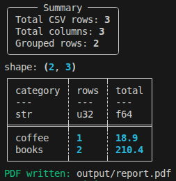

# Data Report Generator



Tests `Polars`, CSV processing, and PDF generation.

```bash
python -m venv .venv
source .venv/bin/activate
pip install -e .
data-report sample output/sales.csv
data-report analyze output/sales.csv --pdf output/report.pdf
```
